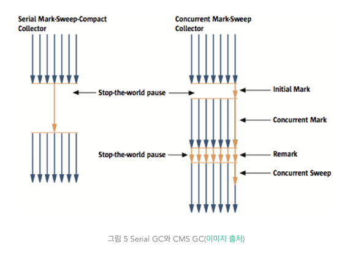

date: 2018-12-11 14:17:31

## 가비지 컬렉션 과정 - Generational Garbage Collection
가비지 컬렉터는 두 가지 가설 하에 만들어졌다

- 대부분의 객체는 금방 접근 불가능 상태(unreachable)가 된다.
- 오래된 객체에서 젊은 객체로의 참조는 아주 적게 존재한다.

이러한 가설을 'weak generational hypothesis'라 한다.

이 가설의 장점을 최대한 살리기 위해서 HotSpot VM에서는 크게 2개로 물리적 공간을 나누었다. 
둘로 나눈 공간이 Young 영역과 Old 영역이다.

- Young 영역(Yong Generation 영역): 
새롭게 생성한 객체의 대부분이 여기에 위치한다.
대부분의 객체가 금방 접근 불가능 상태가 되기 때문에 매우 많은 객체가 young 영역에 
생성되었다가 사라진다.
이 영역에서 객체가 사라질때 Minor GC가 발생한다고 말한다.

- Old 영역(Old Generation 영역):
접근 불가능 상태로 되지 않아 Young 영역에서 살아남은 객체가 여기로 복사된다.
대부분 Young영역보다 크게 할당하며, 크기가 큰 만큼 Young 영역보다 GC는 적게 발생한다.
이 영역에서 객체가 사라질 때 Major GC(혹은 Full GC)가 발생한다고 말한다.

- Permanent Generation 영역(이하 Perm 영역)
Method Area(메소드 영역, 클래스 파일의 바이트 코드들이 로드되는 곳)라고도 한다.
객체나 억류(intern)된 문자열 정보를 저장하는 곳이며, Old 영역에서 살아남은 객체가 영원히 남아 있는곳은 절대 아니다.
이 영역에서 GC가 발생할수도 있는데, 여기서 GC가 발생해도 Major GC의 횟수에 포함된다.

"Old 영역에 있는 객체가 Young 영역의 객체를 참조하는 경우가 있을 때에는 어떻게 처리될까?"
카드 테이블이 존재하고 카드 테이블에는 Old영역에 있는 객체가 Young영역의 객체를 참조할 때마다 정보를 표시한다.
Young영역의 GC를 실행할때는 Old영역에 있는 모든 객체의 참조를 확인하지 않고, 카드 테이블만 뒤져서 GC 대상인지 식별한다.
카드 테이블은 write barrier를 사용하여 관리한다

## Young 영역의 구성
3개로 나뉨
- Eden 영역
- Survivor 영역 2개

아래와 같은 과정을 거친다.
- 새로 생성한 대부분의 객체는 Eden 영역에 위치한다.
- Eden 영역에서 GC가 한 번 발생한 후 살아남은 객체는 Survivor 영역 중 하나로 이동된다.
- Eden 영역에서 GC가 발생하면 이미 살아남은 객체가 존재하는 Survivor 영역으로 객체가 계속 쌓인다.
- 하나의 Survivor 영역이 가득 차게 되면 그 중에서 살아남은 객체를 다른 Survivor 영역으로 이동한다. 그리고 가득 찬 Survivor 영역은 아무 데이터도 없는 상태로 된다.
- 이 과정을 반복하다가 계속해서 살아남아 있는 객체는 Old 영역으로 이동하게 된다.

HotSpot VM에서는 보다 빠른 메모리 할당을 위해서 두 가지 기술을 사용한다
- bump-the-pointer
- TLABs(Thread-Local Allocation Buffers)

## Old 영역에 대한 GC
GC 방식은 JDK 7을 기준으로 5가지 방식이 있다.

- Serial GC :  운영 서버에서 절대 사용하면 안 되는 방식이 Serial GC다. Serial GC는 데스크톱의 CPU 코어가 하나만 있을 때 사용하기 위해서 만든 방식이다. Serial GC를 사용하면 애플리케이션의 성능이 많이 떨어진다.
- Parallel GC
- Parallel Old GC(Parallel Compacting GC)
- Concurrent Mark & Sweep GC(이하 CMS)
- G1(Garbage First) GC

## Serial GC (-XX:+UseSerialGC)
Young 영역에서의 GC는 앞 절에서 설명한 방식을 사용한다.(Young 영역의 GC를 실행할 때에는 Old 영역에 있는 모든 객체의 참조를 확인하지 않고, 이 카드 테이블만 뒤져서 GC 대상인지 식별한다.)
Old 영역의 GC는 mark-sweep-compact이라는 알고리즘을 사용한다.
mark : Old 영역에 살아 있는 객체를 식별
sweep : 힙(heap)의 앞 부분부터 확인하여 살아 있는 것만 남긴다
compaction : 각 객체들이 연속되게 쌓이도록 힙의 가장 앞 부분부터 채워서 객체가 존재하는 부분과 객체가 없는 부분으로 나눈다

## Parallel GC (-XX:+UseParallelGC)
Serial GC와 기본적인 알고리즘은 같다.
그러나 Serial GC는 GC를 처리하는 스레드가 하나인 것에 비해, Parallel GC는 GC를 처리하는 쓰레드가 여러 개이다.
Parallel GC는 메모리가 충분하고 코어의 개수가 많을 때 유리하다. 
Throughput GC

## Parallel Old GC(-XX:+UseParallelOldGC)
Parallel Old GC는 JDK 5 update 6부터 제공한 GC 방식
Parallel GC와 비교하여 Old 영역의 GC 알고리즘만 다르다
Mark-Summary-Compaction
Summary : 앞서 GC를 수행한 영역에 대해서 별도로 살아 있는 객체를 식별한다.

## CMS GC (-XX:+UseConcMarkSweepGC)

초기 Initial Mark 단계에서는 ....클래스 로더에서 가장 가까운 객체 중 살아 있는 객체만 찾는 것으로 끝낸다. 
따라서, 멈추는 시간은 매우 짧다. 
그리고 Concurrent Mark 단계에서는 방금 살아있다고 확인한 객체에서 참조하고 있는 객체들을 따라가면서 확인한다. 
이 단계의 특징은 다른 스레드가 실행 중인 상태에서 동시에 진행된다는 것이다.
그 다음 Remark 단계에서는....  Concurrent Mark 단계에서 새로 추가되거나 참조가 끊긴 객체를 확인한다. 
마지막으로 Concurrent Sweep 단계에서는 쓰레기를 정리하는 작업을 실행한다. 
이 작업도 다른 스레드가 실행되고 있는 상황에서 진행한다.

이러한 단계로 진행되는 GC 방식이기 때문에 stop-the-world 시간이 매우 짧다. 
모든 애플리케이션의 응답 속도가 매우 중요할 때 CMS GC를 사용
Low Latency GC라고도 부른다.

그런데 CMS GC는 stop-the-world 시간이 짧다는 장점에 반해 다음과 같은 단점이 존재한다.

다른 GC 방식보다 메모리와 CPU를 더 많이 사용한다.
Compaction 단계가 기본적으로 제공되지 않는다.
그리고 조각난 메모리가 많아 Compaction 작업을 실행하면 다른 GC 방식의 stop-the-world 시간보다 stop-the-world 시간이 더 길기 때문에 
Compaction 작업이 얼마나 자주, 오랫동안 수행되는지 확인해야 한다.

## G1 GC(-XX:+UseG1GC )

다음 그림에서 보다시피, G1 GC는 바둑판의 각 영역에 객체를 할당하고 GC를 실행한다. 
그러다가, 해당 영역이 꽉 차면 다른 영역에서 객체를 할당하고 GC를 실행한다.
즉, 지금까지 설명한 Young의 세가지 영역에서 데이터가 Old 영역으로 이동하는 단계가 사라진 GC 방식이라고 이해하면 된다. 
G1 GC는 장기적으로 말도 많고 탈도 많은 CMS GC를 대체하기 위해서 만들어 졌다.

힙 영역이 매우 큰 머신(최소 4GB)에서 돌리기에 적합한 GC.
대신 CMS의 단점을 어느 정도는 극복해냈습니다.
힙에 영역(Region) 이라는 개념을 도입한 것인데요, 힙을 여러 개의 Region으로 나눕니다.
몇 몇 Region 은 Young Generation 영역으로 쓰이고, 나머지 몇 몇 Region 은 Old Generation 영역으로 쓰입니다.
Young Generation 영역을 정리하는 건 Parallel이나 CMS처럼 멀티쓰레드로 정리를 합니다.
(뭐 마찬가지로 지울건 지우고, 계속 쓰이고 있는건 Old Generation 영역으로 옮기겠죠.)
그리고, Old Generation 영역에 해당하는 Region이 여러 개 있을 텐데 CMS처럼 백그라운드 쓰레드로 이 영역들을 정리를 합니다.
그런데 CMS와 차이점은 중간 중간 쓸모없는 객체들을 쏙쏙 빼먹는게 아니라.
한 Region을 통째로 정리해 버립니다.
참조가 없는 객체들은 지우고, 사용 중인 객체는 다른 Region으로 고스란히 복사를 합니다.
이 다른 Region으로 사용 중인 객체만 옮기는 과정에서 차곡차곡 옮기므로 Compacting이 되므로 메모리 파편화 현상이 생기지 않는 것이죠!
그렇다면 CMS의 문제점이었던 CPU리소스를 많이 차지한다(1) 그리고 메모리파편화(2) 중에 메모리파편화를 해결한 GC가 되겠네요.

참고) -XX:+UseStringDeduplication : https://dzone.com/articles/easy-change-to-reduce-memory-by-20

## reference
https://d2.naver.com/helloworld/1329
https://12bme.tistory.com/57
https://okky.kr/article/379036
http://wanzargen.tistory.com/17?category=700063

tags:

