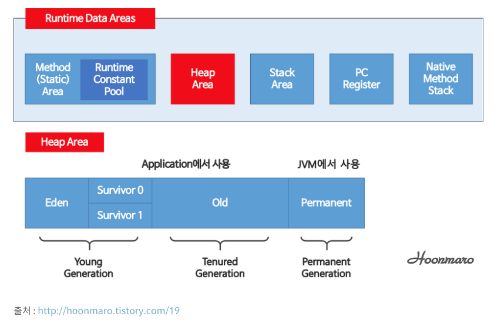

date: 2018-12-13 16:15:25

## 메모리 구조

JVM은 OS로부터 받은 메모리를 나누어관리한다.
이 메모리공간은... Runtime Data Area 라고 하는데 이를 5개 영역으로 쪼개서 관리한다.

- Method Area(=Class Area)
- Stack Area
- Heap Area
- Native Method Stack Area
- PC Register

크게는 메소드영역, 스택영역, 힙영역으로 나눈다.

## 메소드 영역
클래스 파일의 바이트 코드가 로드되는 곳

## 스택 영역
지역변수와 매개변수가 저장된다.
쉽게 말해 프로그램의 실행과정에서 임시로 할당되고 그게 끝나면 소멸되는 것들이 저장된다.
즉 메소드가 호출될때마다 그 메소드의 로컬 변수를 준비하고, 메소드 호출이 끝나면 그 메소드를 위해 준비했던 모든변수가 스택에서 제거 된다.

참조변수에 저장되는 메모리주소는 스택영역에 저장되지만, 그 주소가 가리키는 메모리는 모두 힙 영역에 저장된다.

## 힙 영역
흔히 코드에서 new 명령을 통해 생성된 인스턴스 변수가 놓인다.
힙 영역에 보관되는 메모리는 메소드 호출이 끝나도 사라지지 않고 유지된다.
언제까지?
가비지 컬렉터에 의해서 지워질때 까지..

## 참고
8가지 원시타입(primitive type).. byte, short, int, long, float, double, char, boolean..
을 제외한 그외의 타입으로 정의된 변수들은 모조리 레퍼런스 변수, 즉 참조변수이다.

Primitive와 Boxed Primitives 둘 중 무엇을 사용해야 할까? 
스택 영역에 저장되는 Primitive(기본자료형)과 힙영역에 저장되는 Boxed Primitives(객체형)간에는 메모리 효율과 접근속도면에서 Primitive Type이 뛰어나다.

## reference
- http://wanzargen.tistory.com/16?category=700063
- http://wanzargen.tistory.com/17?category=700063 
- http://www.jpstory.net/2013/02/07/primitive-vs-boxed-primitives/ (자바 Primitive Type과 Boxed Primitives 둘 중 무엇을 사용할까?)

tags:
