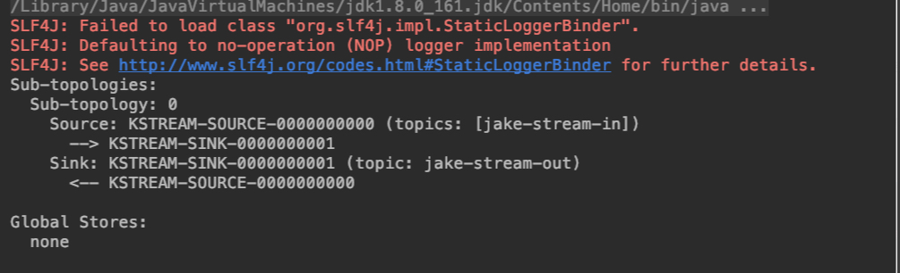
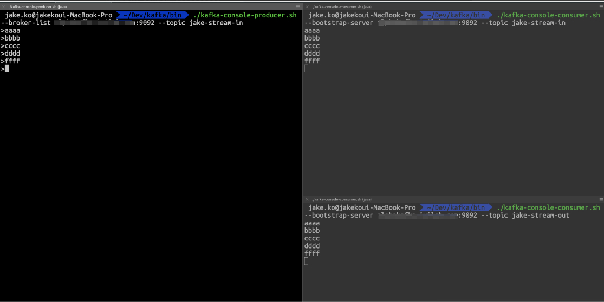
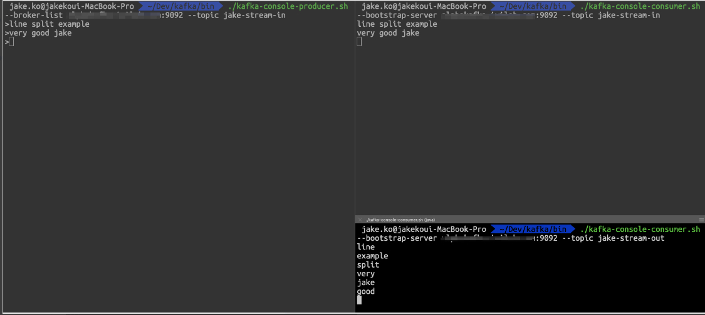
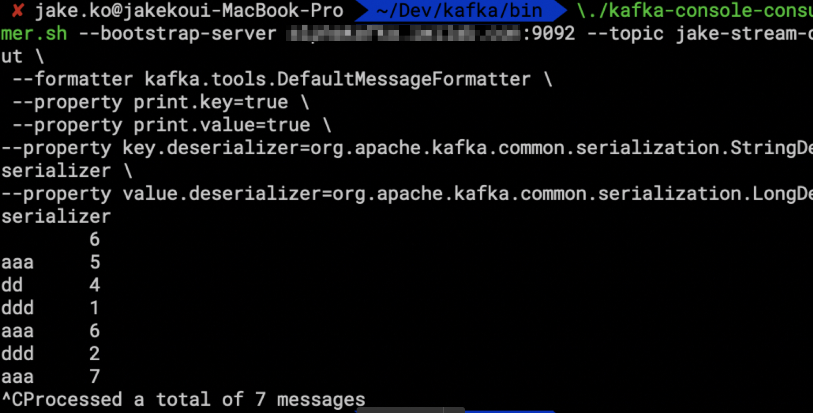

date: 2018-11-22 10:48:50

## 소개
- 카프카 스트림즈는 카프카에 저장된 데이터를 처리하고 분석하기 위해 개발된 클라이언트 라이브러리다.
- 카프카 스트림즈는 이벤트 처리 시간과 처리 시간을 분리해서 다루고 다양한 시간 간격 옵션을 지원하기에 실시간 분석을 간단하면서도 효율적으로 진행할 수 있다.

## 특징
- 간단하고 가벼운 클라이언트 라이브러리이기 때문에 기존 애플리케이션이나 자바 애플리케이션에서 쉽게 사용할수 있습니다.
- 시스템이나 카프카에 대한 의존성이 없습니다.
- 이중화된 로컬 상태 저장소를 지원합니다.
- 카프카 브로커나 클라이언트에 장애가 생기더라도 스트림에 대해서 1번만 처리가 되도록 보장합니다.
- 밀리초 단위의 처리 지연을 보장하기 위해 한번에 한 레코드만 처리합니다.
- 간단하게 스트림 처리 프로그램을 만들 수 있도록 고수준의 스트림 DSL(Domain Specific Language)을 지원하고, 저수준의 프로세싱 API도 제공합니다.

## 스트림 만들기 예제
```java
package test.kafka;
 
import org.apache.kafka.common.serialization.Serdes;
import org.apache.kafka.streams.KafkaStreams;
import org.apache.kafka.streams.StreamsBuilder;
import org.apache.kafka.streams.StreamsConfig;
import org.apache.kafka.streams.Topology;
 
import java.util.Properties;
import java.util.concurrent.CountDownLatch;
 
public class Pipe {
 
    public static void main(String[] args) throws Exception {
        Properties props = new Properties();
        props.put(StreamsConfig.APPLICATION_ID_CONFIG, "jake-streams-pipe");
        props.put(StreamsConfig.BOOTSTRAP_SERVERS_CONFIG, "localhost:9092");
        props.put(StreamsConfig.DEFAULT_KEY_SERDE_CLASS_CONFIG, Serdes.String().getClass());
        props.put(StreamsConfig.DEFAULT_VALUE_SERDE_CLASS_CONFIG, Serdes.String().getClass());
 
        final StreamsBuilder builder = new StreamsBuilder();
 
        builder.stream("jake-stream-in").to("jake-stream-out");
 
        final Topology topology = builder.build();
        System.out.println(topology.describe());
 
        final KafkaStreams streams = new KafkaStreams(topology, props);
        final CountDownLatch latch = new CountDownLatch(1);
 
        // attach shutdown handler to catch control-c
        Runtime.getRuntime().addShutdownHook(new Thread("streams-shutdown-hook") {
            @Override
            public void run() {
                streams.close();
                latch.countDown();
            }
        });
 
        try {
            streams.start();
            latch.await();
        } catch (Throwable e) {
            System.exit(1);
        }
        System.exit(0);
    }
    
 
}

```

## 출력 결과
아래와 같은 토폴로지가 만들어진다.


하나의 토픽을 그대로 복사한 토픽이 생겼다. ( jake-stream-in 의 토픽내의 메시지를 실시간으로 복사하는 jake-stream-out 토픽이 생겼다)


## 응용
jake-stream-out이란 토픽에 실시간으로 분석한 결과를 넣을 수 있다. (ex. 단어 split , 또는 단어 빈도 세기)



## 참고
- 카프카 console-producer console-consumer는 그냥 콘솔로 메시지 생성, 소비한다.
- 카프카 설치 파일의 bin에 위치해 있음.  (http://kafka.apache.org/downloads.html)
